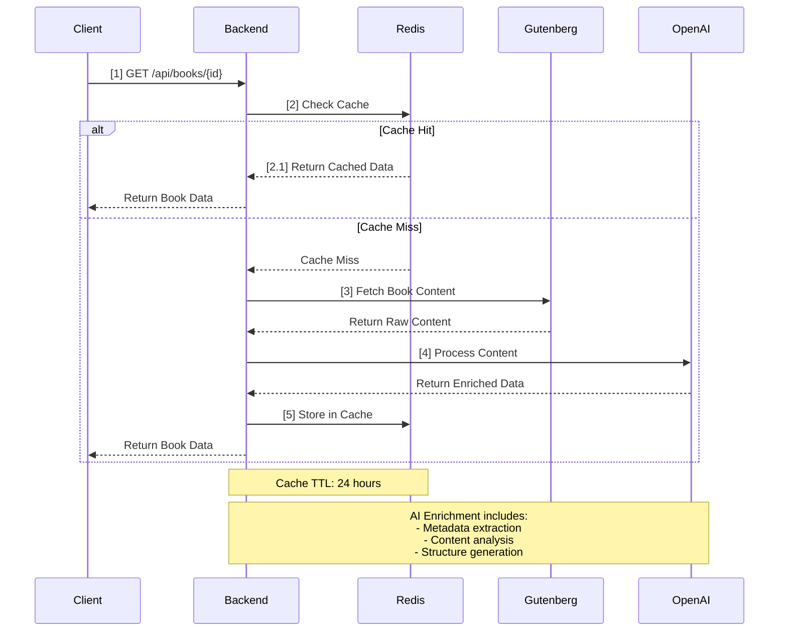
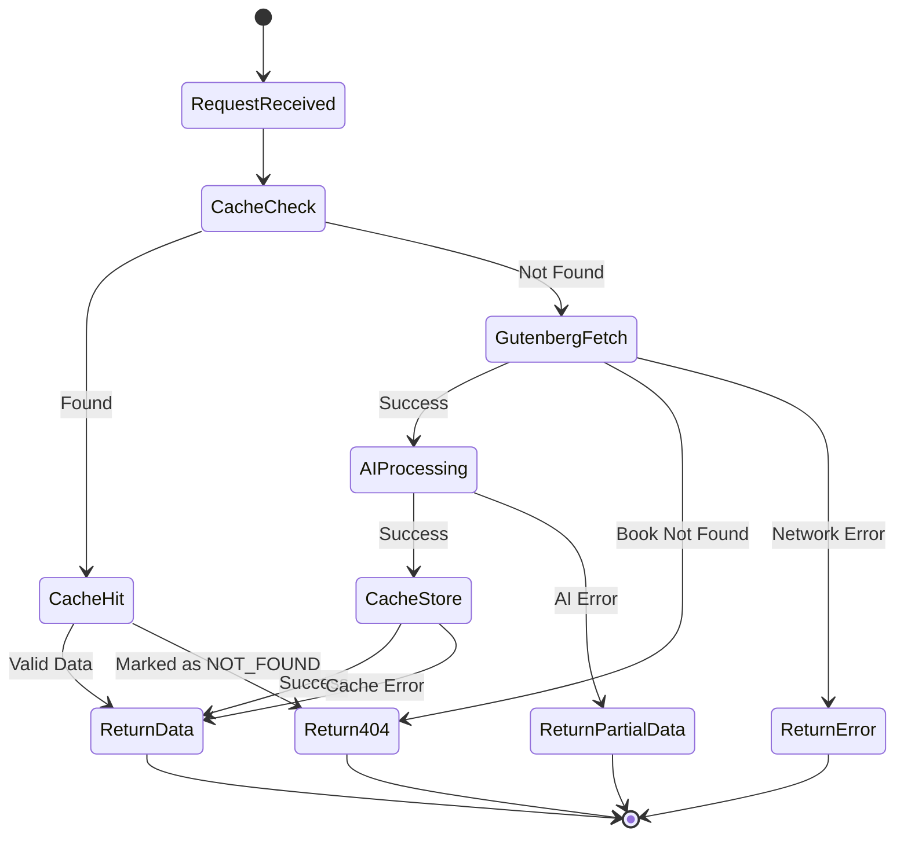

# Full Stack TypeScript Application

A full-stack application with React (Vite + TypeScript) frontend and Node.js (Express + TypeScript) backend, featuring OpenAI integration and Redis caching. The application fetches books from Project Gutenberg and uses AI to analyze and provide structured information about them.

## Prerequisites

- Docker
- Docker Compose
- Node.js 20+ (for local development without Docker)
- OpenAI API Key

## Quick Start

### Development Environment (Recommended)

The project includes a development-focused Docker Compose configuration with features like hot-reload, debugging, and development tools.

```bash
# Start the development environment with hot-reload
docker-compose -f docker-compose.dev.yml up --build

# To rebuild and start
docker-compose -f docker-compose.dev.yml up --build --force-recreate

# To stop
docker-compose -f docker-compose.dev.yml down
```

This will start:
- Frontend with Vite dev server
- Backend with ts-node and hot-reload
- Redis server
- Rebrow (Redis UI)

### Access Points & Services

#### Frontend
- URL: http://localhost:5173
- Features:
  - Hot-reload enabled
  - Real-time file changes
  - Development debugging

#### Backend API
- URL: http://localhost:4000
- Swagger Documentation: http://localhost:4000/api-docs
- Features:
  - Project Gutenberg Integration
  - OpenAI Analysis
  - Redis Caching
  - TypeScript/Express

#### Data Flow
1. Request book by ID
2. Check Redis cache
3. If not cached:
   - Fetch from Project Gutenberg:
     - Content: `https://www.gutenberg.org/files/{id}/{id}-0.txt`
     - Metadata: `https://www.gutenberg.org/ebooks/{id}`
   - Process with OpenAI
   - Store in cache
4. Return structured book information

#### Redis Management
- Redis Server: localhost:6379
- Redis UI (Rebrow): http://localhost:5001
  - Access Configuration:
    - Host: `redis`
    - Port: `6379`
    - Database: `0`
  - Features:
    - Real-time data monitoring
    - Cache inspection
    - Key management

### Environment Configuration

Create `.env` files in respective folders:

```env
# frontend/.env
VITE_API_URL=http://localhost:4000

# backend/.env
PORT=4000
NODE_ENV=development
OPENAI_API_KEY=your-api-key-here
REDIS_URL=redis://redis:6379
```

## Local Development (Alternative)

Only use this if you can't use Docker for some reason.

### Frontend

```bash
cd frontend
npm install
npm run dev
```

### Backend

```bash
cd backend
npm install
npm run dev
```

## Tech Stack

### Frontend
- React
- TypeScript
- Vite
- Nginx (production)

### Backend
- Node.js
- Express
- TypeScript
- OpenAI
- Redis

### DevOps
- Docker
- Docker Compose
- Nginx
- Rebrow (Redis UI)

## Troubleshooting

### Common Issues

1. **Ports in Use**
   - 5173: Frontend Development
   - 4000: Backend API
   - 6379: Redis
   - 5001: Rebrow UI
   
   Solution: Ensure these ports are available or modify in docker-compose.dev.yml

2. **Redis Connection Issues**
   - Check if Redis container is running: `docker ps`
   - Verify Redis URL in backend .env
   - Try connecting via Rebrow UI to test connection

3. **OpenAI Integration**
   - Ensure valid API key in backend .env
   - Check API response in backend logs
   - Verify network connectivity

### Cleanup

Remove all containers and volumes:

```bash
# Development environment cleanup
docker-compose -f docker-compose.dev.yml down -v --remove-orphans
```


## Book Reading Process

### Detailed Flow

The book reading process follows a sophisticated caching and enrichment strategy:

1. **Initial Request**
   - User requests a book by its ID
   - System logs the request with a unique identifier

2. **Cache Check**
   - System checks Redis cache using key pattern `book:{id}`
   - If found:
     - Returns cached book data
     - If cached as 'NOT_FOUND', returns 404 error
   - Cache TTL: 24 hours

3. **Gutenberg Fetch (If Not Cached)**
   - Downloads book content from Project Gutenberg
   - Retrieves both content and metadata
   - Handles potential network errors

4. **AI Enrichment**
   - Processes book metadata with AI
   - Extracts structured information
   - Enhances book content with AI analysis

5. **Cache Storage**
   - Stores enriched book data in Redis
   - Caches negative results for not found books
   - Implements error handling and logging

### System Architecture Diagram



### Error States Diagram



### Error Handling

- **Cache Errors**: Graceful fallback to Gutenberg
- **Gutenberg Errors**: Returns 404 for not found books
- **AI Processing Errors**: Logs error and returns base content
- **System Errors**: Returns appropriate HTTP status codes

### Performance Considerations

- 24-hour cache TTL balances freshness and performance
- Async processing for AI enrichment
- Structured logging for monitoring
- Error caching prevents repeated failed requests


## Contributing

1. Fork the project
2. Create your feature branch (`git checkout -b feature/AmazingFeature`)
3. Commit your changes (`git commit -m 'Add some AmazingFeature'`)
4. Push to the branch (`git push origin feature/AmazingFeature`)
5. Open a Pull Request

## License

This project is licensed under the MIT License - see the [LICENSE](LICENSE) file for details.